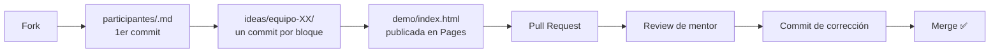

# Ideathon Stellar × BAF × CANACINTRA

Repositorio oficial del ideathon. **Aquí vive tu idea y aquí se mide tu participación.**

> 📘 ¿Nunca has usado GitHub? Empieza por **[guia-github.md](guia-github.md)**. Se hace todo desde el navegador, sin instalar nada.

---

## Qué se entrega

Cada equipo entrega **un Pull Request** con esta carpeta:

```
ideas/equipo-XX-nombre-de-la-idea/
├── 01-problema.md    ← problema, cliente, evidencia
├── 02-caso-uso.md    ← patrón Stellar + test de 4 preguntas
├── 03-modelo.md      ← quién paga y cuánto
├── 04-pitch.md       ← guion de 3 minutos
├── evidencia.md      ← diagrama + la URL de su demo
└── demo/
    └── index.html    ← su página, publicada en GitHub Pages
```

**Su demo queda en línea**, con URL propia, lista para enseñarla en el pitch desde cualquier celular:

```
https://<tu-usuario>.github.io/Ideathon-Stellar-BAF-Canacintra/ideas/equipo-XX/demo/
```

Las plantillas están en [`plantillas/`](plantillas/) — incluida [`plantillas/demo/index.html`](plantillas/demo/index.html), que se copia a `ideas/equipo-XX/demo/index.html` y se edita en el navegador. Los puntos a cambiar están marcados con ✏️ dentro del archivo.
Hay un ejemplo completo en [`ideas/equipo-00-ejemplo/`](ideas/equipo-00-ejemplo/).

Y **cada persona** —haya equipo o no— crea su propio archivo:

```
participantes/<tu-usuario-github>.md
```

Ese es tu primer commit del día. Es individual e intransferible.

---

## Flujo del día



**Un archivo = un commit.** No junten todo al final: cada bloque del día cierra con su commit, y eso se evalúa.

---

## Cómo se evalúa

| Qué | Peso |
|---|---|
| Calidad de la idea (jurado) | 70 pts |
| Disciplina de ejecución (historial de Git, automático) | 30 pts |

Detalle completo en [rubrica.md](rubrica.md). Premios: mejor idea, mejor problema, mejor uso de Stellar, mejor modelo de negocio y **equipo más constante** (el mejor historial de commits del evento).

---

## Material de consulta

Todo el material técnico y de casos de uso vive en **[Stellar-Guide](https://github.com/MarxMad/Stellar-Guide)**:

| Necesitas… | Ve a |
|---|---|
| Catálogo de casos de uso por industria | [`docs/contratos-casos-uso.md`](https://github.com/MarxMad/Stellar-Guide/blob/main/docs/contratos-casos-uso.md) |
| Combinaciones end-to-end ya armadas | [`docs/playbooks-producto.md`](https://github.com/MarxMad/Stellar-Guide/blob/main/docs/playbooks-producto.md) |
| Qué son las anclas y los SEPs | [`docs/sep-estandares-anclas.md`](https://github.com/MarxMad/Stellar-Guide/blob/main/docs/sep-estandares-anclas.md) |
| Tu primer pago en Testnet (bonus N2) | [`exercises/01-pago-simple.md`](https://github.com/MarxMad/Stellar-Guide/blob/main/exercises/01-pago-simple.md) |
| Desplegar un contrato (bonus N3) | [`docs/comandos-basicos.md`](https://github.com/MarxMad/Stellar-Guide/blob/main/docs/comandos-basicos.md) |
| Contratos listos por caso de uso | [`contracts/`](https://github.com/MarxMad/Stellar-Guide/tree/main/contracts) |

---

## Ideas presentadas

<!-- Se llena al cerrar el evento: queda como catálogo de proyectos para las empresas de la cámara -->

| Equipo | Idea | Vertical | PR |
|---|---|---|---|
| | | | |
