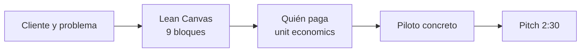

# Temario vivo — Ideathon Stellar × BAF × CANACINTRA

| | |
|---|---|
| **Edición** | 25 de agosto de 2026 · plan rearmado en sala a las 11:25 |
| **Ventana** | 11:25–17:00 |
| **Foco** | Metodología Lean Canvas. Stellar como riel, no como requisito. |
| **Entregable por equipo** | `lean-canvas.md` y `pitch.md` en `ideas/equipo-XX-nombre-corto/` vía fork y Pull Request |
| **Soporte** | Papel, laptop o el canvas digital en `presentaciones/canvas.html` |

**Presentaciones para proyectar:** [`../presentaciones/index.html`](../presentaciones/index.html)

---

## Enfoque

El objetivo de esta tarde no es publicar software. Es que cada equipo salga con una hipótesis de negocio que un empresario de CANACINTRA pueda discutir el lunes: quién duele, quién paga, cuánto, por qué ahora, y cuál es el primer piloto.

Stellar es contexto: pagos, USDC, anclas y registro. No hay que encajar la idea a la red. Si no aporta, el canvas se llena igual. Lo básico está en [`../stellar.md`](../stellar.md).

---

## Objetivos de la tarde

Al cerrar a las 17:00, el equipo será capaz de:

1. **Llenar un Lean Canvas** en el orden correcto, con frases específicas, no slogans.
2. **Separar cliente, usuario y pagador.**
3. **Nombrar la alternativa actual** y el costo de seguir con ella.
4. **Proponer un modelo de ingreso** con precio y contraqué se compara.
5. **Calcular unit economics** incluyendo el costo de conversión a pesos, no solo el de la red.
6. **Dimensionar mercado de abajo hacia arriba** (empresas × operaciones × ticket × comisión).
7. **Identificar una empresa piloto** y qué le pedirían el lunes.
8. **Defender la hipótesis en dos minutos y medio.**

---

## Agenda 11:25–17:00

| Hora | Min | Bloque | Modalidad | Entregable |
|---|---|---|---|---|
| 11:25–11:35 | 10 | **R0** · Reset: el día cambia | Plenaria | Sala alineada |
| 11:35–12:15 | 40 | **B1** · Lean Canvas: los 9 bloques | Plenaria | — |
| 12:15–13:00 | 45 | **B2** · Taller: llenar el canvas | Taller | Canvas v1 |
| 13:00–13:45 | 45 | Comida | — | — |
| 13:45–14:35 | 50 | **B3** · Modelo de negocio y unit economics | Sesión + taller | Números en el canvas |
| 14:35–15:25 | 50 | **B4** · Sprint: piloto, validación, canvas final | Taller | Canvas completo + piloto |
| 15:25–15:35 | 10 | Pausa | — | — |
| 15:35–16:10 | 35 | **B5** · Ensayo de pitch | Taller | Guion 2:30 |
| 16:10–16:55 | 45 | **B6** · Presentaciones ante jurado | Plenaria | Pitch |
| 16:55–17:00 | 5 | **B7** · Cierre y premiación | Plenaria | — |

**Total: 280 minutos de trabajo** más comida y una pausa. La comida **no se mueve** (13:00–13:45).

**Proyector:** abrir `presentaciones/index.html`. Cada bloque tiene su deck.

---

## R0 · Reset: el día cambia (11:25–11:35)

Deck: `presentaciones/00-reset.html`

Anuncio corto, sin debate largo:

- El trabajo de la tarde es el Lean Canvas, los números y el pitch.
- Cómo se evalúa: problema, canvas, modelo, pitch. No se puntúa el “ajuste” a Stellar.
- El canvas se sube por fork y Pull Request (ver `04-git.html`).
- A las 16:10 empiezan las presentaciones. Equipo sin canvas no sube.

---

## B1 · Lean Canvas: los 9 bloques (11:35–12:15)

Deck: `presentaciones/01-lean-canvas.html`

**Objetivo:** que nadie empiece a dibujar la solución antes de nombrar al cliente.

### Qué es y qué no es

El Lean Canvas (Ash Maurya) es una hipótesis de una página. No es un plan de negocio, no es un pitch deck y no se llena de izquierda a derecha como un póster.

**Orden de llenado:**

1. Segmentos de clientes
2. Problema (tres dolores, el principal primero)
3. Propuesta única de valor
4. Solución (un verbo por dolor)
5. Canales
6. Flujos de ingreso
7. Estructura de costos
8. Métricas clave
9. Ventaja injusta

### Los 9 bloques, en lenguaje de sala

| Bloque | Pregunta que debe responder | Señal de alerta |
|---|---|---|
| **Segmentos** | ¿Quién es, con industria, tamaño y geografía? | "Las PyMEs" / "todos" |
| **Problema** | Tres dolores. El #1 con costo en pesos o días. | "Pagos lentos" sin cifra |
| **Propuesta de valor** | ¿Qué cambia para el cliente el martes siguiente? | Eslogan ("el Uber de…") |
| **Solución** | Un verbo por dolor, no un stack técnico | Empiezan por blockchain |
| **Canales** | ¿Cómo llegan a la primera decena de clientes? | "Redes sociales" |
| **Ingresos** | Quién paga, cuánto, contra qué alternativa | Precio sin comparativo |
| **Costos** | Qué les cuesta entregar una operación | Olvidar on/off ramp |
| **Métricas** | 2 o 3 números que dirían si el piloto funciona | Vanidad: likes, visits |
| **Ventaja injusta** | Qué no pueden copiar en 30 días | “Usamos blockchain” a secas |

**Ejemplo de trabajo en sala:** factoraje a un proveedor Tier 2 de autopartes en el Bajío (ver `ideas/equipo-00-ejemplo/`).

---

## B2 · Taller: llenar el canvas (12:15–13:00)

Canvas digital: `presentaciones/canvas.html` · ficha: `plantillas/lean-canvas.md`

| Tiempo | Qué pasa |
|---|---|
| 12:15–12:20 | Cada equipo abre el canvas (papel o laptop). Un escribano, no cuatro. |
| 12:20–12:40 | Bloques 1 a 4: cliente, problema, propuesta, solución |
| 12:40–12:55 | Bloques 5 a 9 en borrador, aunque queden feos |
| 12:55–13:00 | Foto o archivo guardado. Nadie come sin canvas v1. |

**Regla:** si una casilla tiene más de 12 palabras, está mal. Cortar.

Mentores: una sola pregunta por mesa — *¿quién firma el cheque?* — y siguen.

---

## B3 · Modelo de negocio y unit economics (13:45–14:35)

Deck: `presentaciones/02-modelo-negocio.html`

**Objetivo:** que el canvas deje de ser un póster y aguante una pregunta de dinero.

### Contenido (20 min de clase)

- **Quién paga ≠ quién usa.** El tesorero, compras o el dueño firman; el operador usa.
- **Modelos aplicables:** comisión por transacción (bps), suscripción por empresa, diferencial cambiario, fee de originación.
- **Unit economics por operación:** ingreso − fee de red − conversión a pesos − operación = margen.
- Si hay conversión a pesos, **ese costo** (no el de la red) define el margen. Omitirlo es la falla más frecuente.
- **Mercado de abajo hacia arriba:** empresas alcanzables × operaciones al mes × ticket × comisión. Prohibido "el 1 % de un mercado de X mil millones".
- CANACINTRA es canal, no mercado: cuántas empresas de *esta* vertical, en *esta* delegación.
- **Por qué ahora:** regulación, nearshoring, rieles de stablecoin, costo de la tecnología.
- **Riesgo #1 y mitigación.** Nombrarlo suma.
- **Piloto del lunes:** empresa con nombre, vía de entrada, petición concreta.

### Taller (30 min)

Llenar la ficha `plantillas/modelo.md` y copiar los números a las casillas de ingresos y costos del canvas.

---

## B4 · Sprint: piloto, validación, canvas final (14:35–15:25)

| Tiempo | Actividad |
|---|---|
| 14:35–14:50 | Validación cruzada: cada equipo escucha el canvas de otro. Pregunta única: *¿pagarías esto?* |
| 14:50–15:10 | Corrección con lo que escucharon. Nombrar piloto. |
| 15:10–15:25 | Canvas final. Mentores marcan casillas vacías o vagas. |

**Cierre de bloque:** canvas con las 9 casillas, números y una empresa piloto. Sin eso, no hay pitch.

---

## B5 · Ensayo de pitch (15:35–16:10)

Deck: `presentaciones/03-pitch.html` · guion: `plantillas/pitch.md`

Dos minutos treinta. Máximo dos personas al frente.

| Tiempo | Sección |
|---|---|
| 0:00–0:25 | Problema con cifra |
| 0:25–0:45 | Cliente y quién paga |
| 0:45–1:20 | Solución: tres verbos |
| 1:20–1:55 | Modelo: precio, margen, mercado chico y honesto |
| 1:55–2:30 | Piloto del lunes y riesgo #1 |

Ensayo en mesa con cronómetro. A las 16:05, orden de salida.

---

## B6 · Presentaciones (16:10–16:55)

Dos minutos treinta de pitch y un minuto de preguntas. Cronómetro proyectado.

Con 8 equipos: ~28 min de pitch + 8 min de preguntas. Con 10: recortar preguntas a 45 segundos. Con 12: pitch a 2:00.

**Jurado:** viabilidad industrial (CANACINTRA) y modelo de negocio.

---

## B7 · Cierre (16:55–17:00)

Premios en voz alta, sin ceremonial largo:

- Mejor hipótesis de negocio (voto CANACINTRA)
- Mejor problema
- Equipo que mejor iteró después de la validación cruzada

Continuidad: conversación con empresas de la cámara para los equipos con piloto nombrado.

---

## Evaluación

Toda la calificación es de jurado y mentores. No hay componente de repositorio.

| Criterio | Pts | Qué se busca |
|---|---|---|
| Problema y cliente | 25 | Frase con costo cuantificado. Cliente específico. Alternativa actual. |
| Lean Canvas | 25 | Nueve bloques específicos, en el orden correcto, sin slogans. |
| Modelo de negocio | 30 | Quién paga, unit economics, mercado bottom-up, piloto. |
| Pitch | 20 | Cabe en 2:30 y aguanta la pregunta de dinero. |

**Bonus (hasta +5):** nombrar el riesgo mayor.

Criterios detallados en la [rúbrica](../rubrica.md).

---

## Material de esta tarde

| Material | Quién lo usa |
|---|---|
| [`presentaciones/index.html`](../presentaciones/index.html) | Facilitador · hub del proyector |
| [`presentaciones/00-reset.html`](../presentaciones/00-reset.html) | Sala, 11:25 |
| [`presentaciones/01-lean-canvas.html`](../presentaciones/01-lean-canvas.html) | Sala, 11:35 |
| [`presentaciones/02-modelo-negocio.html`](../presentaciones/02-modelo-negocio.html) | Sala, 13:45 |
| [`presentaciones/03-pitch.html`](../presentaciones/03-pitch.html) | Sala, 15:35 |
| [`presentaciones/04-git.html`](../presentaciones/04-git.html) | Cómo entregar canvas y pitch |
| [`presentaciones/canvas.html`](../presentaciones/canvas.html) | Equipos, llenable y imprimible |
| [`../stellar.md`](../stellar.md) | Lo básico de la red |
| [`plantillas/lean-canvas.md`](../plantillas/lean-canvas.md) | Equipos |
| [`plantillas/modelo.md`](../plantillas/modelo.md) | Equipos (apoyo) |
| [`plantillas/pitch.md`](../plantillas/pitch.md) | Equipos · entregable |
